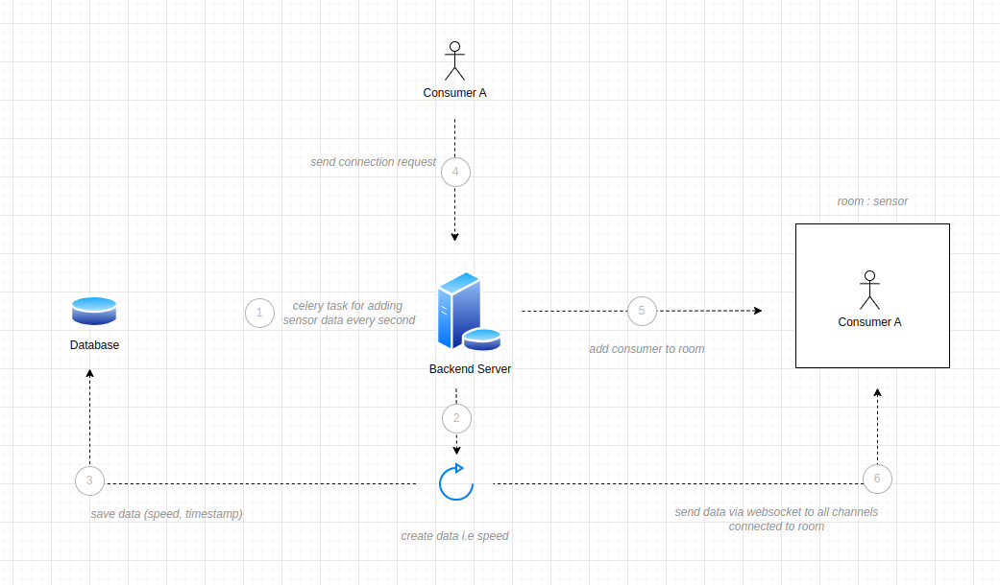
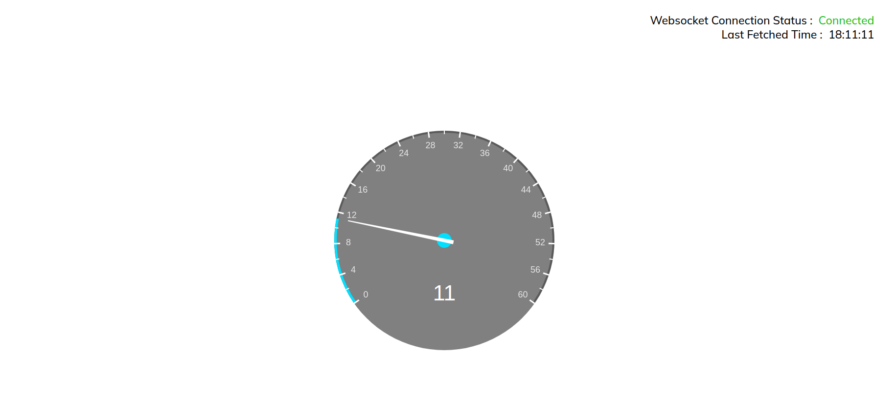

# Speedo-Meter Frontend | Unbox Robotics
`v1.0.0`


## System Prerequisites

1. Make sure you have docker and docker-compose installed on your local system.
2. Make sure the backend server is up and running.
3. Creating a `.env` environment file
    ```
    REACT_APP_WEBSOCKET_URL='ws://localhost:8001/ws/speed-data/'
    ```

<br>

## Spinning up the server using Docker

1. Create migration files locally
    ```
    docker-compose up --build
    ```

Open [http://localhost:3000](http://localhost:3000) to view it in your browser.

<br>

## Architecture

<div align="center">

</div>

<br>

## Sample App Image

<div align="center">

</div>